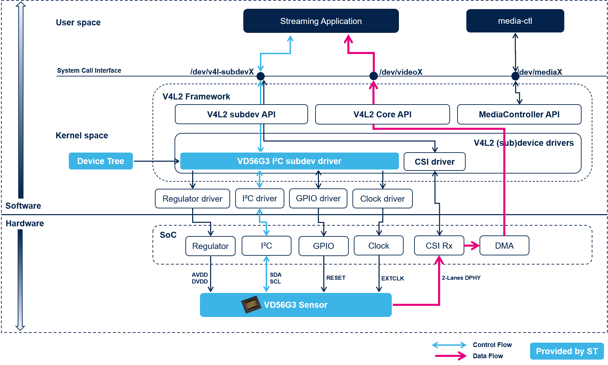

===============
System Overview
===============

The **Linux VD56G3 driver** (st-vd56g3.c) is based on the `Video4Linux2 framework`_ akka V4L2 framework. V4L2 is the official Linux Kernel API to handle video devices including capture devices like camera sensors.

The `V4L2 framework`_ defines the API the Linux VD56G3 driver supports in order to be V4L2 compliant. The Linux kernel uses the camera driver to initialize the hardware and produce video frames. 

Generally camera driver interacts with camera sensor over a low frequency configuration interface (I2C or SPI). The camera sensor streams output data over a dedicated high speed data serial interface.

An overview of the resulting architecture is given on the figure below.

    VD56G3 sub-device driver within Video4Linux framework.

On the figure above, the control flows appears with light blue arrows. The VD56G3 sensor can be controlled thanks to the linux VD56G3 sub-device driver. Once configured, the streaming can start: the data flow (illustrated with pink arrows) is grabbed by the CSI receiver embedded in the main SoC and then offered through DMA to the userspace applications.

On modern systems, the camera sensor is generally separated from the ISP (which is integrated in the main SoC). Both sensor and CSI receiver are modular `V4L2 sub-devices`_. It is then necessary to have a Media-Controller component that could setup and configure the full media pipeline. The sensors fitting in those architecture are called Media-Controller based devices.

.. _Video4Linux2 framework: https://www.kernel.org/doc/html/latest/driver-api/media/v4l2-core.html
.. _V4L2 framework: https://www.kernel.org/doc/html/latest/driver-api/media/v4l2-core.html
.. _V4L2 sub-devices: https://www.kernel.org/doc/html/latest/driver-api/media/v4l2-subdev.html