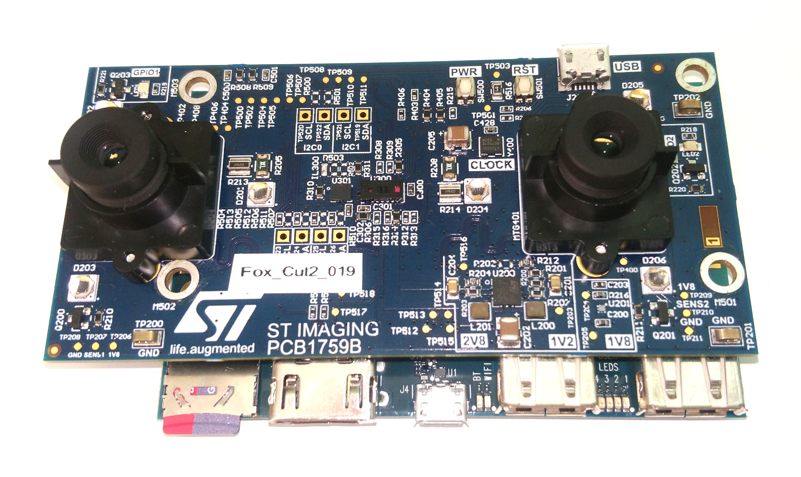

.. _vd56g3_on_db410:

==========================
VD56G3 on DragonBoard 410C
==========================

.. Note::
    This quickstart targets the dragonboard 410C platform. The global workflow is similar to the RPI one.
    The available implementation of V4L2 for the dragonboard is a little bit different than the one available for the RPI.
    Consequently, one of the main difference with the RPI is that the db410c will require media pipeline setup before streaming.

Required Hardware
=================

    Mezzanine PCB1759B stacked on Dragonboard 410C

- Arrow DragonBoard DB410c + 12V Power Supply + micro SD Card
- Peripherals: Screen, Mouse, Keyboard, USB-Ethernet adapter, cables, etc. 
- ST Mezzanine PCB1759B (with 2 VD56G3 sensors)

Step-by-step guide
==================

#. Install linux on the DragonBoard

    #. Retrieve the `linux image <https://citools.st.com/projects/gpz/releases/artifactory/v4l2/d410c/d410c_sdcard_builder/master/129/deploy/sd.img>`_ from artifactory. This is a Debian image based on Kernel 4.19.
    #. Flash the downloaded .img file on the micro SD card

        - On Windows, `Win32 Disk Imager <https://sourceforge.net/projects/win32diskimager/>`_ can be used
        - On Linux, use the following ``dd`` command line::

            dd if=db410c-debian_stretch-4.9-lxqt.sdcard.img of=/dev/<your_sdcard_device> bs=1M

    #. Configure DragonBoard's switches to boot on the SD Card

        .. figure:: img/db410c_boot_switches.jpg

#. Linux customization on first boot

    .. Note:: 
        The debian image comes with a preconfigured user ``linaro``, password ``linaro``

    .. Warning::
        Depending of your network infrastructure, you may be required to configure proxy settings

    #. If the date/time is not correct, use the following commandline to set it manually ::

        sudo date -s "May 10 11:25:30 CEST 2021"

    #. [optionnal] Change keyboard layout (default = US) ::

        # switch to french keyboard layout
        setxkbmap fr

    #. [optionnal] Add additionnal packages (``graphviz`` package provides the ``dot`` utility) ::

        sudo apt install graphviz 

#. Install last Fox driver 

    #. Retrieve the driver from the git repository::

        git clone ssh://gitolite@codex.cro.st.com/imgfox/linux/driver/vd56g3.git

    #. Build then install the driver as a module::

        cd vd56g3
        make
        sudo cp st-vd56g3.ko /lib/modules/`uname -r`/kernel/drivers/media/i2c/.
        sudo depmod -a

#. Update the Device Tree to describe the vd56g3 Setup

    #. Use the ``configure`` utility to update the device tree ::

        # Switch to the root user
        sudo su

        # Launch 'configure' shell, select the 'PCB1759A' configuration, then save and quit
        configure

        Command (h for help): a
          0 - st0971_6640
          1 - vgxy61
          2 - st0971_6768
          3 - vd56g3
          4 - PCB1756A
          5 - PCB1756B
          6 - PCB1759A
        Select device to add (0-6, default 0): 6
        Command (h for help): w
        Command (h for help): q

    #. Reboot the board, to take into account the new device tree ::

        # As root    
        reboot

    #. At startup the driver status can be checked in dmesg output::

        dmesg | grep vd56g3

#. Configure Media Controller Pipeline (must be done after each boot)

    #. Setup Media Controller Pipeline ::

        sudo media-ctl -d /dev/media0 -l '"msm_csiphy0":1->"msm_csid0":0[1],"msm_csid0":1->"msm_ispif0":0[1],"msm_ispif0":1->"msm_vfe0_rdi0":0[1]'

    #. [Optional] Ensure that you have the correct pipeline topogy

        Your topology should look like the figure below.

        .. figure:: img/db410c_media-pipeline.png
            :width: 60%
            :align: center

        .. note::
            On the figure above, only the ``st-vd56g3 4-0010`` sensor is "linked" to an output (here ``/dev/video0`` node)
            The second sensor (``st-vd56g3 1-0010``) is not yet linked to a pipeline.

        The topology can be exported with the following commands ::

            sudo media-ctl -d /dev/media0 --print-dot > db410c_media-pipeline.dot
            dot -Tpng db410c_media-pipeline.dot > db410c_media-pipeline.png

    #. Configure Pipeline entities ::

        # Configure the pipeline entities with SGBRG8 format and 480x640 resolution
        sudo media-ctl -v -d /dev/media0 -V '"st-vd56g3 4-0010":0[fmt:SGBRG8_1X8/480x640@1/30 field:none],"msm_csiphy0":0[fmt:SGBRG8_1X8/480x640 field:none],"msm_csid0":0[fmt:SGBRG8_1X8/480x640 field:none],"msm_ispif0":0[fmt:SGBRG8_1X8/480x640 field:none],"msm_vfe0_rdi0":0[fmt:SGBRG8_1X8/480x640 field:none]'

#. Make the sensor stream ! 

    Please see the :ref:`sensor_streaming` section for a more detailed description of streaming applications.

Alternative for media pipeline setup and sensor streaming
=========================================================

    The current linux image for the dragonboard410c comes with a prebuilt ``capture`` application (a shortcut is available on the desktop)

    .. important ::
        The ``capture`` application **automatically handle media controller pipeline setup**.

    #. Open ``capture`` application using the shortcut on the desktop

    #. Select which sensor to stream, output resolution and FPS.

        .. figure:: img/db410c_capture-app.png
            :width: 60%
            :align: center

    #. Stream !
