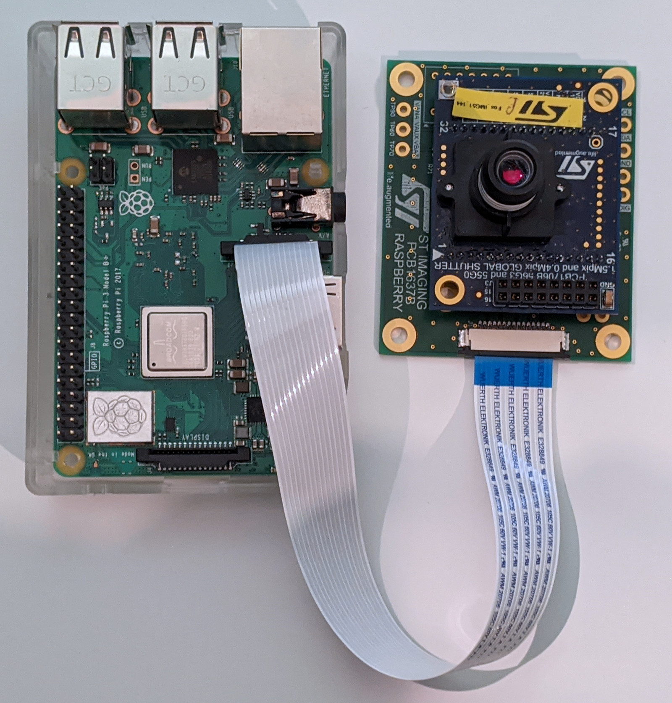

================================
VD56G3 on RPI - Quickstart Guide
================================

Required Hardware
=================

    RPI + rpi2spider board (PCB1637) + Fox Sensor (PCB1706B)

- Raspberry PI + SD card + Power adapter
- Fox sensor; 2 options are availables:
    
    A. ST Raspberry to SPIDER adapter (PCB1637-00B) + ST FOX Demo OLGA80 (PCB1706B)

        .. figure:: img/fox_pcb1637b_pcb1706b.jpg
            :width: 35%

    B. ST FOX MiniPlugin OLGA80 (PCB1718A)

        .. figure:: img/fox_pcb1718a.jpg
            :width: 20%

- Inverted Flex cable

    .. figure:: img/rpi_flex_cable_inverted.jpg
        :width: 70%

- Peripherals: Screen, Mouse, Keyboard, cables, etc.

Step-by-step guide
==================

#. Install linux on the RPI

    #. Retrieve lastest `raspbian image <https://downloads.raspberrypi.org/raspios_armhf/images/raspios_armhf-2020-12-04/2020-12-02-raspios-buster-armhf.zip>`_ .
    #. Flash the downloaded .img file on the micro SD card

        - On Windows, you can use `Win32 Disk Imager <https://sourceforge.net/projects/win32diskimager/>`_
        - On Linux, you can use ``dd`` with the following command line::

            dd if=2020-12-02-raspios-buster-armhf.img of=/dev/<your_sdcard_device> bs=1M

#. Linux customization on first boot

    .. Note::
        Depending of your network infrastructure, you may be required to setup proxy.
    
    #. Follow the RPI wizard to configure: locales, default password, network connection, etc.

    #. By the end of the wizard, update your system.

    #. Install linux kernel headers and devicetree compiler::

        sudo apt install raspberrypi-kernel-headers device-tree-compiler

    #. You can also add interesting packages (will be used in next steps) ::

        sudo apt install vim qv4l2 yavta
        

#. Install last Fox driver 

    #. Retrieve the driver from the git repository::

        git clone ssh://gitolite@codex.cro.st.com/imgfox/linux/driver/vd56g3.git

    #. Build then install the driver as a module::

        cd vd56g3
        make
        sudo cp st-vd56g3.ko /lib/modules/`uname -r`/kernel/drivers/media/i2c/.
        sudo depmod -a

#. Update the Device Tree to describe the new Fox Setup

    .. Note ::
        The Raspberry ecosystem make big use of device tree overlays. On RPI, the overlays are precompiled and are located in the ``/boot/overlays`` folder.

    The device tree is used to describe hardware components of the system. Thus it must be updated with hardware changes.
    
    In the present quickstart, two HW configurations are offered to connect the Fox sensor to the RPI. Because there is some differences with the pinout of the 2 solutions, it's important to use the correct device tree overlay.

    #. Get the overlay source:

        The `vd56g3_rpi2spider_overlay.dts`_  overlay file corresponding to the setup A. (RPI + PCB1637-00B + PCB1706B) is available in the ``doc`` subdirectory of the ``vd56g3`` git repository.

        The content of the ``vd56g3_rpi2spider_overlay.dts`` is reproduced below: 

        .. literalinclude:: ./vd56g3_rpi2spider_overlay.dts

        .. Important ::
            For the setup B. (FOX MiniPlugin - PCB1718A), the ``fox_ep`` endpoint must be updated to reflect the CSI lane inversion. See below the addition of the property ``lane-polarities = <1 1 1>;`` ::

                    fox_ep: endpoint {
                        clock-lanes = <0>;
                        data-lanes = <1 2>;
                        remote-endpoint = <&csi1_ep>;
                        clock-noncontinuous;
                        link-frequencies = 
                            /bits/ 64 <201000000 402000000 804000000>;
                        lane-polarities = <1 1 1>;
                    };

        .. _vd56g3_rpi2spider_overlay.dts: https://codex.cro.st.com/plugins/git/imgfox/linux/driver/vd56g3?a=blob_plain&h=0bc0515d738fea4f38ccc9c46f315c05acd9ad4e&f=doc%2Fvd56g3_rpi2spider_overlay.dts&noheader=1

    #. Overlay compilation and installation ::

        # Compile using the device tree compiler
        dtc -o vd56g3.dtbo vd56g3_rpi2spider_overlay.dts
        # Copy the vd56g3 compiled overlay
        sudo cp vd56g3.dtbo /boot/overlays/.
        # Enable vd56g3 overlay
        sudo sh -c 'echo "dtoverlay=vd56g3" >> /boot/config.txt'
    
    #. Finally the RPI must be rebooted. At startup one can check the driver status ::

            dmesg | grep vd56g3

#. Make the sensor stream ! There's a lot of ways to grab frames; 3 alternatives are described below

    #. The ``qv4l2`` utility provides a pannel to adjust all controls of the sensor (resolution, pixelformat, framerate, exposure, custom controls, etc.). 
       We can also make the sensor stream in a windows. Unfortunately the pixel format conversion (realized in SW) is horrible slow and the FPS won't go upper than 15FPS.

    #. With ``yavta`` command line tool, one can grab frames via commandline ::

        # Capture 20 frames @ 640x480, format SGBRG8, 90 FPS, save frame on disk
        yavta /dev/video0 --capture=20 --size 640x480 --format SRGGB8 --time-per-frame 1/90 --file 
        
    #. There is also a ``yavta fork`` customized for RPI. This version make use of RPI GPU features for pixel format conversion and it enables to display the frames on the screen ::

        # Retrieve the yavta fork
        git clone https://github.com/6by9/yavta.git

        # Build It
        cd yavta/
        make

        # Grab @1124x1364, 60FPS and display on screen
        ./yavta --capture=1000 --size 1124x1364 --format SRGGB8 /dev/video0 --time-per-frame 1/60 --mmal

About Optical-Flow
==================

The current Fox driver has a branch with Optical Flow support.

To enable OF, one must rebuild the driver and reinstall it ::

    # From the fox repository
    git checkout optical_flow
    make
    sudo cp st-vd56g3.ko /lib/modules/`uname -r`/kernel/drivers/media/i2c/.
    sudo depmod -a
    reboot

With the current driver implementation, the Optical Flow infos are passed at the end of the frame.
Frame sizes are extended by 64 lines. So one would be able to see new resolutions supported by the sensor. 
Find below the list of all resolutions containing OFs:

    - ``240x384`` (240x320 for image + 240x64 for OF)
    - ``320x304`` (320x240 for image + 320x64 for OF)
    - ``480x704`` (480x640 for image + 480x64 for OF)
    - ``640x544`` (640x480 for image + 640x64 for OF)
    - ``720x1344`` (720x1280 for image + 720x64 for OF)
    - ``1024x1088`` (1024x1024 for image + 1024x64 for OF)
    - ``1024x1344`` (1024x1280 for image + 1024x64 for OF)

.. Important::
    The OF grabbing is done using a debug feature of the sensor in order to have Image and OF on the same Channel/Datatype. 
    This was done because, there’s currently no Virtual Channel support on Linux V4L2 (or at least not mainstreamed).
    The backside is that using the FOX this way decrease the performances. We can’t reach nominal 60FPS in such debug mode; we should be able to reach 40FPS.

The ``yavta fork`` has been customized to support Optical Flow ::

    # Retrieve the yavta-rpi fork
    git clone ssh://gitolite@codex.cro.st.com/imgappliswlinuxdevplatform/packages/yavta-rpi.git

    # Switch to the Fox branch, then compile
    cd yavta-rpi
    git checkout fox
    make

This ``yavta`` version provides an ``--of`` parameter what can be used:

    - in conjunction with the ``--file`` parameter to save Optical Flow in files (on OF file per frame)
    - in conjunction with the ``--mmal`` parameter to mark the Optical Flow by a white pixel on the display
        
    .. Warning:: 
        Due to line stride not correctly taken into account, there's a bug when resolutions ``240x384`` and ``720x1344`` are used with the Optical Flow option (``--of``).

Below a few one-liners commented ::

    # Grab @1024x1344 (1024x1280 + 64 lines of OF), 40FPS, then display. OFs are interpreted as image data, thus displayed as gibberish data at the end of the frame
    ./yavta --capture --size 1024x1344 --format SRGGB8 /dev/video0 --time-per-frame 1/40 --mmal

    # Grab @1024x1344 (1024x1280 + 64 lines of OF), 40FPS, then display. OFs are marked as white pixels on top of the image
    ./yavta --capture --size 1024x1344 --format SRGGB8 /dev/video0 --time-per-frame 1/40 --mmal --of

    # Capture 300 frames @480x704 (480x640 + 64 lines of OF), 40FPS. The 300 frames are saved as file on the rpi storage (one file for the raw image, one file for the OF)
    ./yavta --capture=300 --size 480x704 --format SRGGB8 /dev/video0 --time-per-frame 1/40 --of --file

In order to tune Optical Flow, 5 V4L2 custom controls have been added to the driver:

    - ``OF - Spatial Filter`` to control ``V4L2_CID_OF_SPATIAL_FILTER`` register
    - ``OF - Target number of descriptor`` to control ``V4L2_CID_OF_DESC_TARGET`` register
    - ``OF - Window Width`` to control ``V4L2_CID_OF_WINDOW_WIDTH`` register
    - ``OF - Window Height`` to control ``DEVICE_OF_HAMMING_DISTANCE_HEIGHT`` register
    - ``OF - Threshold`` to control ``DEVICE_OF_HAMMING_THRESHOLD`` register

Those controls can be modified:

    - graphically using ``qv4l2`` Test Bench, via the ``User Controls`` pane.
    - in command line using the ``yavta`` ::

        # Listing all available controls
        yavta --list-controls /dev/video0
        # Modifying the target number of descriptor (ID ``0x00981922``) to 1800
        yavta --set-control '0x00981922 1800' /dev/video0